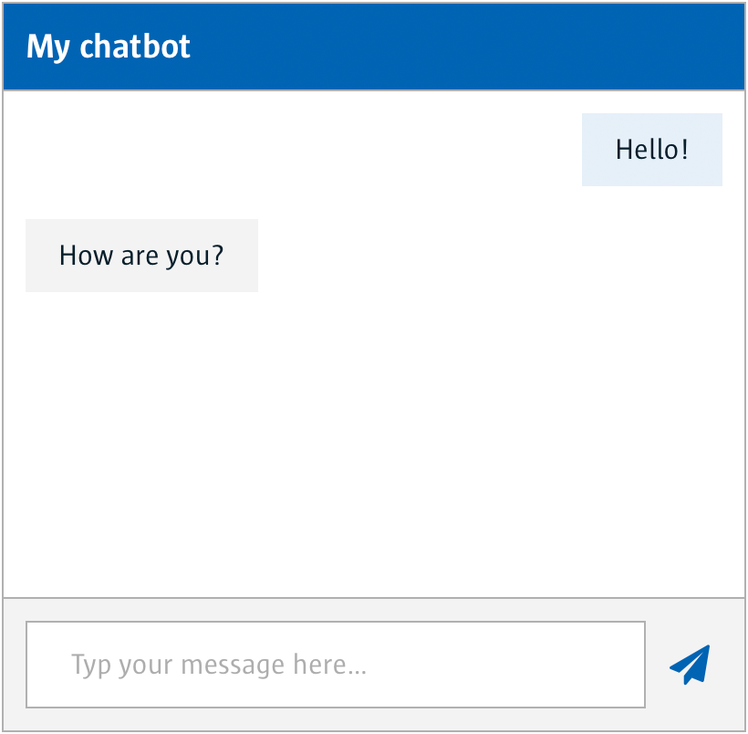

# Chatbot Smart Widget UI (Angular)

With the chatbot smart widget you can simply implement a chatbot in any page.

You will also need the BFF package in order to get the chatbot smart widget to work: [http://github.com/TriangleJuice/chatbot_service_nodejs](http://github.com/TriangleJuice/chatbot_service_nodejs)



There is a demo app, see below for instructions on running it.

## How to use

### Installing

```sh
> npm install @acpaas-ui-widgets/ngx-chatbot
```

Import the component in your module:

```js
@NgModule({
  imports: [
    ...,
    ChatbotModule
  ],
  ...
})
```

In the index.html, include the core branding stylesheet:

```html
<link rel="stylesheet" href="https://cdn.antwerpen.be/core_branding_scss/5.0.1/main.min.css">
```

> For projects that are still using Angular 5, we are [maintaining a v1 branch](https://github.com/digipolisantwerp/chatbot_widget_angular/tree/v1), which will still receive bug fixes if needed.

```sh
> npm install @acpaas-ui-widgets/ngx-chatbot@"<2.0.0"
```

### In your template

```html
<aui-chatbot
  url="http://localhost:3000/api/bff"
  session="123456789"
  title="My great chatbot widget"
  placeholder="Type your message here…"
  [pinned]="false"
  [delay]="200"
  [height]="400">
</aui-chatbot>
```

### Supported attributes

#### **url**
`string` BFF URL.

#### **session**
`string` Required session ID for the chatbot engine, where each chat conversation is linked to its chat session. It's important to use a unique id, since all session data, like answers already given, are stored in the chatbot engine.

#### **title**
`string` Title above the chat window.

#### **pinned**
`boolean` Whether the chatbot is inline or pinned to the bottom of the application.

#### **placeholder**
`string` Placeholder string in the chat input field.

#### **delay**
`number` Delay between multiple messages received from the chatbot engine.

#### **height**
`number` Height of the chatbot in pixels. Can only be used when `pinned="false"`.

#### **width**
`number` Width of the chatbot in pixels. Can only be used when `pinned="true"`. Will not be smaller than `18rem`.

#### **avatar**
`string` Avatar image URL. Default is the special provided Antwerp icon.

#### **aria**
`ChatbotMessageAriaLabels` Accessibility strings used throughout the chatbot UI:

Default:

```js
{
  chatbot: 'Chatbot',
  close: 'Chatbot minimaliseren',
  avatar: 'Chatbot:',
  user: 'Jij:',
  message: 'Te verzenden bericht',
  send: 'Bericht verzenden',
  toggle: 'Een vraag stellen',
}
```

### Events

#### **actionStarted**
Triggers when the user clicks a button of a message with type `action`. This type of message is injected by the BFF by injecting it into the response. The `actionStarted` output event requires a defined action and pauses the workings of the chatbot widget, waiting for a method call (`completeAction`) that has the same defined action. It allows the developer to handle some things outside the chatbot (e.g. a payment) before returning to the chatbot conversation.

##### How does it work?

```
<aui-chatbot
  #myChatbotWithAction
  [url]="'http://localhost:3000/api/chatbot'"
  [session]="session1"
  (actionStarted)="triggerMe($event)">
</aui-chatbot>
```

1. Your BFF sends a message of type `action` with one or more actions defined.

  ```js
  {
    actions: [
      {
        action: 'someAction',
        text: 'Click me',
      }
    ]
  }
  ```

2. When the user clicks this button, the defined `actionStarted` output event will fire and the chatbot is disabled.

  ```
  public triggerMe(event) {
    // Do something with `event`
  }
  ```

3. `$event` can now be handled in the parent controller and whenever finished, the chatbot widget's `completeAction` method can be triggered to re-enable the chatbot conversation. The result will be sent as a hidden message to the chatbot engine.

  > Important! The method property of `completeAction` has to contain the exact same `action` value that was first defined when disabling the chatbot, otherwise the chatbot will just ignore the method call.

  ```js
  const result = {
    action: 'someAction',
    message: 'success',
  }
  this.myChatbotWithAction.completeAction(result);
  ```

## Run the demo app

```sh
> npm install
> npm start
```

Browse to [localhost:4200](http://localhost:4200)

In order to use the chatbot widget demo app, you will also need to have started the corresponding back-end service.

## Contributing

We welcome your bug reports and pull requests.

Please see our [contribution guide](CONTRIBUTING.md).

## Support

Jasper Van Proeyen (<jasper.vanproeyen@digipolis.be>)

## License

This project is published under the [MIT license](LICENSE.md).
